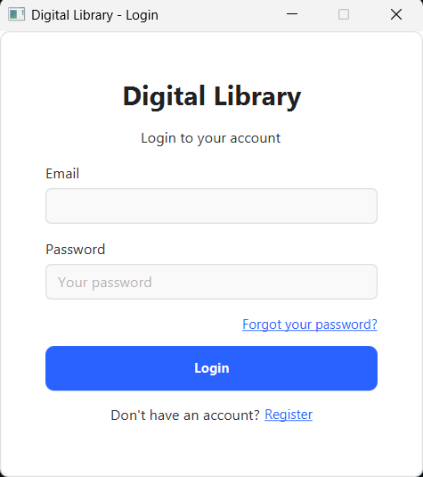
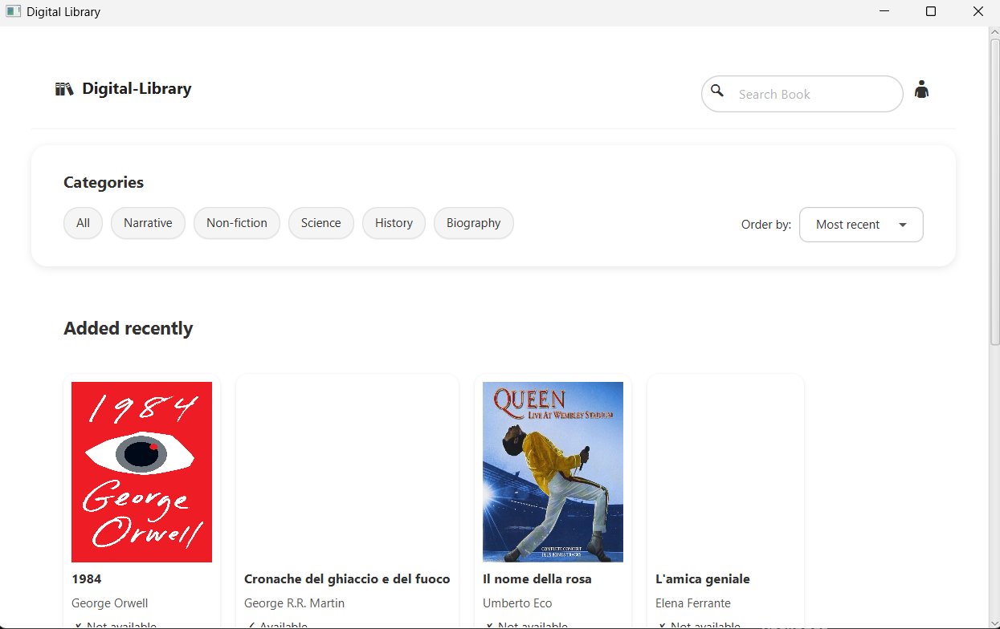
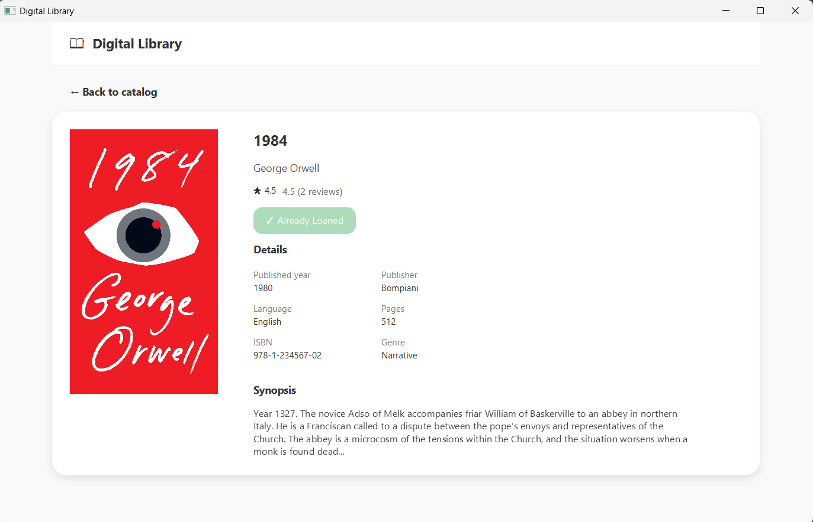
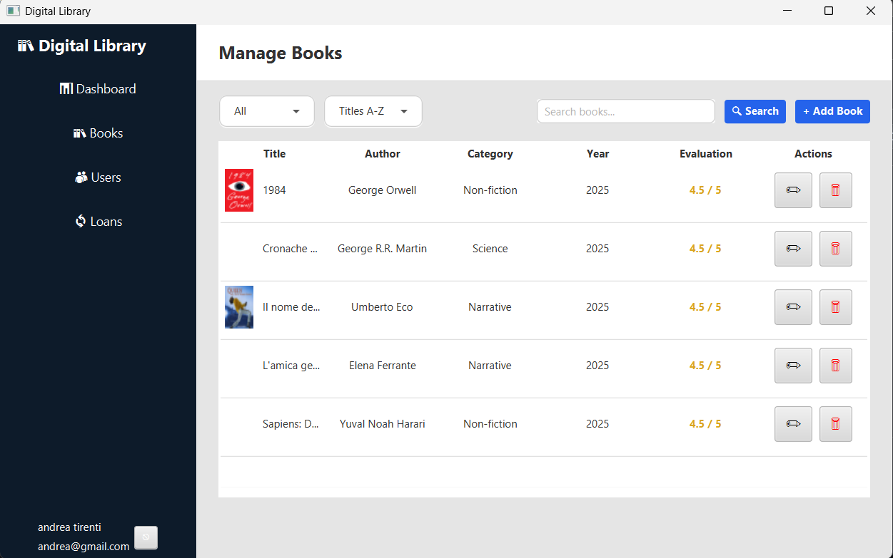
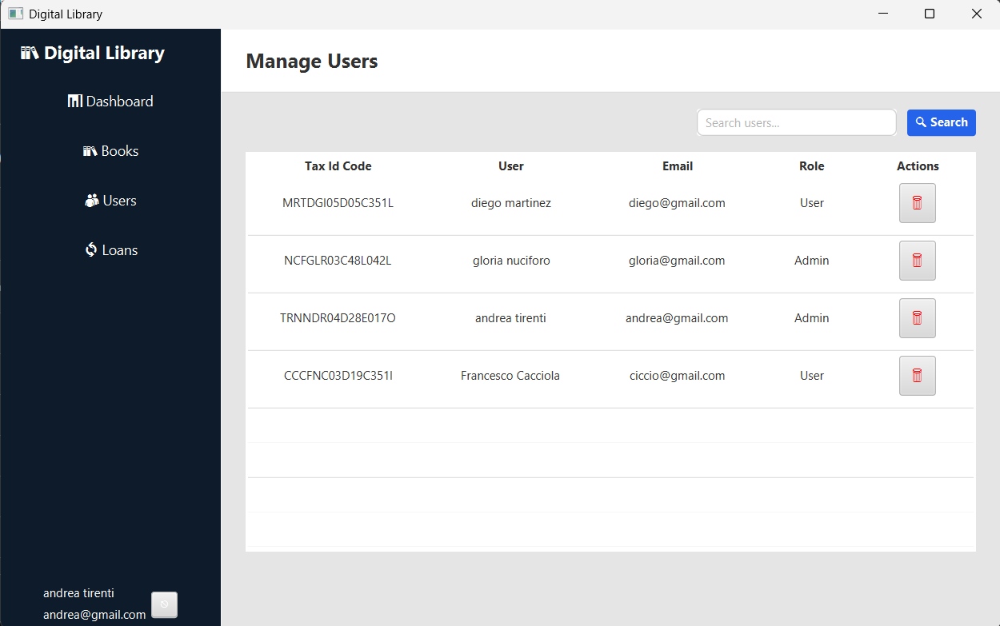

# 📚 Digital Library


---

> Applicazione desktop JavaFX per la gestione di una biblioteca digitale.  
> Progetto universitario sviluppato da **Andrea Tirenti** e **Diego Martinez**.

---

## 🖼️ Screenshot

|                 Login                 |                   Home                    |              Dettagli Libro               |
|:-------------------------------------:|:-----------------------------------------:|:-----------------------------------------:|
|  |  |  |

|                Admin - Home                |           Admin - Gestione Libri           |       Admin - Gestione Utenti       |
|:------------------------------------------:|:------------------------------------------:|:-----------------------------------:|
|  |  |  |

---

## 🛠️ Tecnologie Utilizzate

- **Java 23+**
- **JavaFX 17.0.6** per l’interfaccia grafica
- **Gson** per la serializzazione JSON
- **JUnit 5** per i test
- **Maven** per la gestione del progetto, dipendenze e build

---

## 🚀 Istruzioni per l'esecuzione

### 🔧 Requisiti

- Java JDK 23 o superiore
- Maven installato e configurato (`mvn -v` per verificarlo)
- Un IDE compatibile con Maven (IntelliJ consigliato) **oppure** terminale

### 📥 Clonazione del progetto

```bash
git clone https://github.com/Dr-Faxzty/Digital-Library.git
cd digital-library
```

### ▶️ Esecuzione da IDE

1. Apri il progetto con **IntelliJ** o un altro IDE compatibile con Maven.

2. Assicurati che il JDK selezionato sia **Java 23** o superiore.

3. Apri il file `MainApp.java` e clicca su Run.

4. In alternativa, esegui `javafx:run` dal pannello Maven.

### 🖥️ Avvio da terminale

```bash
mvn clean install
mvn javafx:run
```

**✅ Comandi utili**
```bash
mvn test         # Esegue tutti i test JUnit
mvn javafx:run   # Avvia l'app JavaFX
```

> Modifica i comandi in base alla struttura della tua cartella se necessario (es. includi i package).

---

## 📄 **Relazione Tecnica**

Per approfondire l'architettura, i pattern utilizzati, le decisioni progettuali e il processo di sviluppo, consulta la relazione tecnica completa disponibile al seguente link:

👉 [docs/relazione.md](docs/relazione.md)

---

