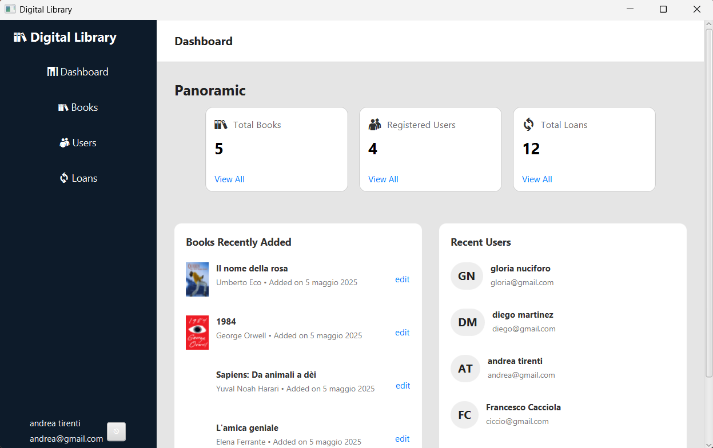

# 📚 Digital Library


---

> Applicazione desktop JavaFX per la gestione di una biblioteca digitale.
> Progetto universitario sviluppato da **Andrea Tirenti** e **Diego Martinez**.

---

## 🖼️ Screenshot

|                 Login                 |                   Home                    |              Dettagli Libro               |
|:-------------------------------------:|:-----------------------------------------:|:-----------------------------------------:|
|  |  |  |

|                Admin - Home                |           Admin - Gestione Libri           |       Admin - Gestione Utenti       |
|:------------------------------------------:|:------------------------------------------:|:-----------------------------------:|
|  |  |  |

---

## 🛠️ Tecnologie Utilizzate

* Java 23+
* JavaFX per la GUI
* Gson per la serializzazione JSON
* JUnit per il testing

---

## 🚀 Istruzioni per l'esecuzione

### 🔧 Requisiti

* Java JDK 23 o superiore installato
* Un IDE (IntelliJ, VSCode, Eclipse) **oppure** terminale

### 📥 Clonazione del progetto

```bash
git clone https://github.com/Dr-Faxzty/Digital-Library.git
cd digital-library
```

### ▶️ Avvio da IDE

1. Apri la cartella `digital-library` nel tuo IDE.
2. Assicurati che il JDK selezionato sia Java 23+.
3. Esegui `MainApp.java`.

### 🖥️ Avvio da terminale

```bash
javac -d out $(find src -name "*.java")
java -cp out MainApp
```

> Modifica i comandi in base alla struttura della tua cartella se necessario (es. includi i package).

---

## 📄 **Relazione Tecnica**

Per approfondire l'architettura, i pattern utilizzati, le decisioni progettuali e il processo di sviluppo, consulta la relazione tecnica completa disponibile al seguente link:

👉 [docs/relazione.md](docs/relazione.md)

---

