# Relazione Tecnica – Biblioteca Digitale

## Introduzione al Progetto

Il progetto "Biblioteca Digitale" consiste nella realizzazione di un'applicazione desktop in linguaggio Java per la gestione di una biblioteca virtuale.  
L'obiettivo principale è simulare il funzionamento di un sistema bibliotecario, permettendo a utenti e amministratori di interagire con un catalogo di libri in modo semplice e intuitivo.

L'applicazione è sviluppata seguendo l'architettura **MVC (Model-View-Controller)** e fa ampio uso di **design pattern classici (GoF)** per garantire modularità, estendibilità e riutilizzabilità del codice.

Tra le funzionalità principali:
- Registrazione e login degli utenti
- Visualizzazione e ricerca dei libri
- Prestito e restituzione dei libri
- Gestione dei contenuti da parte degli amministratori
- Filtri avanzati e statistiche sull’utilizzo

L’interfaccia grafica è stata realizzata utilizzando **JavaFX**, al fine di offrire una user experience più moderna rispetto alla CLI.  
I dati vengono salvati e caricati da file in formato **JSON**, permettendo una persistenza semplice e portabile.

Il progetto è stato sviluppato con particolare attenzione alla chiarezza del codice, alla documentazione e alla copertura tramite test unitari.

## Metodologia di Sviluppo

Lo sviluppo del progetto è stato suddiviso in **quattro fasi principali**, ispirate a una metodologia a cascata adattata alle tempistiche e alla struttura del lavoro di gruppo.  
Questa suddivisione ci ha permesso di mantenere ordine, tracciabilità e una distribuzione chiara dei compiti.

### 🟦 1. Concezione
Durante questa fase iniziale, il team ha analizzato il problema da affrontare e i requisiti forniti dal docente.  
Sono stati individuati gli attori principali (utenti e amministratori), le funzionalità fondamentali e le criticità legate all’architettura e alla gestione dello stato del sistema.

Abbiamo anche valutato le tecnologie da adottare (JavaFX per l’interfaccia grafica, JSON per la persistenza) e identificato la necessità di applicare almeno 7 design pattern classici GoF.

### Analisi dei Requisiti

Questa sezione presenta un’analisi dettagliata dei requisiti del sistema, suddivisi in categorie per facilitarne la comprensione e l’implementazione.

---

#### Requisiti Funzionali

I requisiti funzionali descrivono le funzionalità specifiche che il sistema deve fornire:

1. **Gestione degli Utenti**
  - Il sistema deve consentire la registrazione e l’autenticazione degli utenti.
  - Ogni utente deve avere un ruolo: normale o amministratore.
  - Gli utenti devono poter visualizzare, ricercare e prendere in prestito i libri disponibili.

2. **Gestione dei Libri**
  - Il sistema deve permettere l’inserimento, la modifica e la rimozione di libri (solo per gli admin).
  - I libri devono essere visualizzabili in una lista, filtrabili per titolo, autore e categoria.

3. **Gestione dei Prestiti**
  - Il sistema deve consentire agli utenti di prendere in prestito e restituire libri.
  - I prestiti devono avere una durata limitata e uno stato (in corso, scaduto, restituito).
  - Gli amministratori devono poter visualizzare tutti i prestiti effettuati.

---

#### Requisiti Non Funzionali

I requisiti non funzionali descrivono aspetti qualitativi del sistema:

- **Usabilità:** Interfaccia intuitiva e user-friendly tramite JavaFX.
- **Modularità:** Architettura a componenti separati (MVC) e uso di design pattern.
- **Portabilità:** Esecuzione multipiattaforma grazie a Java.
- **Manutenibilità:** Codice documentato, organizzato per package e testato.
- **Performance:** Caricamento asincrono dei dati per evitare blocchi nell’interfaccia.

---

#### Requisiti di Sistema

1. Requisiti Software
- **Build system:** Apache Maven per la gestione delle dipendenze, della compilazione, del run e del testing.
- **Persistenza:** Archiviazione su file JSON (no database).
- **Librerie esterne:** Gson (per la serializzazione JSON), JavaFX (tramite plugin Maven), JUnit 5 (per i test automatizzati).


2. Requisiti Hardware
- **Sistema operativo:** Windows, macOS o Linux.
- **Memoria RAM:** minimo 4 GB.
- **Spazio su disco:** almeno 200 MB liberi per file applicazione e dati JSON.
- **Risoluzione consigliata:** 1280x720 o superiore per una corretta visualizzazione della GUI.

---

### 🟨 2. Definizione
In questa fase ci siamo concentrati sulla progettazione dell’architettura e sulla distribuzione dei compiti tra i membri del team.  
Sono stati redatti i primi **diagrammi UML semplificati**, definite le responsabilità dei singoli pacchetti (`model`, `controller`, `view`, ecc.), e scelti i design pattern più adatti a ogni componente.

È stata inoltre impostata una repository Git per il versionamento del progetto e la collaborazione continua.

---

### 🟧 3. Realizzazione
Il lavoro di sviluppo è stato suddiviso tra i membri del team secondo le competenze e le preferenze individuali. La comunicazione è avvenuta regolarmente tramite strumenti collaborativi, con aggiornamenti condivisi sulla repository GitHub.  
Le principali aree realizzative sono state:

- Modellazione delle entità (`Libro`, `Utente`, `Prestito`) e delle rispettive logiche
- Implementazione dell'interfaccia grafica tramite **JavaFX**
- Realizzazione dei controller e gestione del flusso applicativo
- Gestione della persistenza su file JSON
- Integrazione progressiva dei **design pattern** selezionati (Singleton, Observer, Command, ecc.)

#### Competenze assegnate:

| Parte                               | Chi la gestisce     | Dettagli                                                                      |
|-------------------------------------|----------------------|--------------------------------------------------------------------------------|
| Modulo libri                        | Andrea               | Include: `Book.java`, `BookManager`, `BookController`                         |
| Modulo utenti + auth                | Diego                | Include: `User.java`, `UserManager`, `UserController`                         |
| Modulo prestiti                     | Diego                | Include: `Loan.java`, `LoanManager`, `LoanController`                         |
| Persistenza JSON                    | Andrea               | Gestione salvataggio/caricamento su file JSON con classi `Json*Manager`       |
| Interfaccia utente - utenti         | Diego                | Interfaccia in JavaFX dedicata agli utenti normali (registrazione, ricerca, prestiti) |
| Interfaccia utente - amministratori | Andrea               | JavaFX per funzioni admin (gestione libri, utenti, statistiche)               |
| Test e validazioni                  | Diego + Andrea       | Unit test per modelli, controller e persistenza (JUnit)                       |
| Integrazione e testing finale       | Diego + Andrea       | Demo completa, collaudo, debugging finale e rifinitura dell’UX                |
| Documentazione e diagrammi          | Diego + Andrea       | Relazione tecnica, diagrammi UML, README.md con istruzioni d'uso              |

---

### 🟥 4. Chiusura
Nella fase finale è stata effettuata la **verifica funzionale** del sistema e la stesura della **documentazione tecnica**.  
Sono stati creati test unitari, diagrammi UML definitivi, demo illustrative e il file `README.md` con le istruzioni per l'uso.  
Particolare attenzione è stata data alla separazione tra interfaccia e logica, alla qualità del codice e alla preparazione dei deliverables finali.

---

### Diagramma di Gantt

Per rappresentare visivamente l'avanzamento del lavoro e la suddivisione temporale delle fasi, è stato realizzato il seguente diagramma di Gantt:

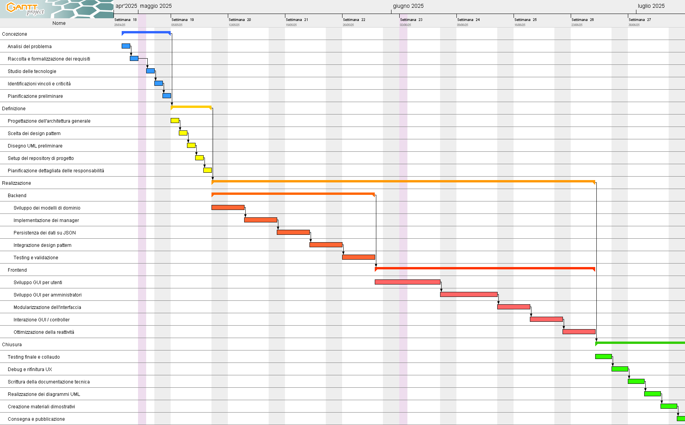

---

## Architettura Generale

Il progetto è strutturato seguendo il paradigma **MVC (Model–View–Controller)**, supportato da un’organizzazione modulare dei package. Ogni componente ha responsabilità ben definite e segue principi di riusabilità e manutenibilità.

### 📁 Struttura dei pacchetti

La struttura dei pacchetti del progetto è la seguente:
```
Digital-Library/
├── pom.xml
├── database/
├── docs/
├── src/
│ ├── main/
│ │   ├── java/
│ │   │   └── com/
│ │   │       └── example/
│ │   │           ├── common/
│ │   │           │   ├── adapter/
│ │   │           │   ├── enums/
│ │   │           │   ├── interfaces/
│ │   │           │   ├── nullObject/
│ │   │           │   ├── observer/
│ │   │           │   ├── state/
│ │   │           │   └── strategy/
│ │   │           ├── controller/
│ │   │           ├── manager/
│ │   │           ├── model/
│ │   │           ├── persistence/
│ │   │           ├── style/
│ │   │           ├── utils/
│ │   │           ├── view/
│ │   │           │   ├── admin/
│ │   │           │   └── user/
│ │   │           └── MainApp.java
│ │   └── resources/
│ │       └── style/
│ └── test/
├── README.md
└── .gitignore

```

---

### Flusso dell'applicazione
```
Utente (via interfaccia JavaFX)
↓
Vista (View - JavaFX)
↓
Controller (Coordina l’azione)
↓
├── Manager (Logica applicativa)
└── Persistenza (Salvataggio/caricamento su JSON)
```

---

### Esempio: Prestito di un libro

1. L’utente clicca su “Prendi in prestito” dalla GUI JavaFX.
2. La vista (`BookDetailView`, ad esempio) invoca il metodo corrispondente nel `LoanController`.
3. Il `LoanController`:
    - chiama il `LoanManager` per verificare la disponibilità del libro e creare il nuovo prestito;
    - aggiorna lo stato del libro tramite il `BookManager`;
    - richiama le classi di persistenza (`JsonLoanManager`, `JsonBookManager`) per **salvare** i cambiamenti nei file `loans.json` e `books.json`.

4. La vista viene aggiornata per riflettere il nuovo stato del libro (non disponibile) e per mostrare il prestito tra quelli attivi dell’utente.

---

## Design Pattern Utilizzati

Durante lo sviluppo del progetto sono stati utilizzati sette design pattern classici appartenenti al catalogo GoF. La scelta dei pattern non è stata casuale, ma guidata dalla volontà di rendere il codice più modulare, estensibile e aderente ai principi SOLID.

---

### 1. Singleton


In un sistema multi-componente, è spesso necessario avere **un unico punto di accesso** a determinati oggetti condivisi (come i controller o i manager). Per evitare istanziazioni multiple e garantire l’accesso globale a un'unica istanza, è stato applicato il pattern **Singleton**.

Questo pattern è stato utilizzato nelle classi:

- `BookManager`, `LoanManager`, `UserManager`: ognuna di queste classi gestisce l’intero insieme di oggetti di dominio (libri, prestiti, utenti). Devono esistere come uniche istanze condivise all’interno dell’applicazione.
- `UserController`, `BookController`, `LoanController`: contengono la logica di collegamento tra GUI e manager. Sono centralizzati e devono essere univoci.
- `SessionManager`: gestisce la sessione utente corrente, e pertanto deve esistere una sola istanza visibile a tutta l’app.

Tutte queste classi implementano la tipica logica `getInstance()` e costruttore privato.

---

### 2. Null Object


Nel sistema era necessario **gestire i casi in cui una ricerca non produce risultati**, ad esempio:

- Un utente cerca un libro inesistente
- Un ID utente non corrisponde a nessun account

Invece di tornare `null` (con il rischio di `NullPointerException`), viene restituito un oggetto **"neutro"** che implementa un comportamento di default.

Sono state create le seguenti classi:

- `NullBook`: restituito quando un libro non è presente nei risultati.
- `NullUser`: per ricerche utente fallite.
- `NullLoan`: per prestiti non trovati.

Ognuna implementa un'interfaccia comune con i rispettivi oggetti reali (`Book`, `User`, `Loan`), ma si comporta in modo prevedibile e sicuro.

Questo pattern ha migliorato la robustezza del sistema e semplificato il codice nelle GUI e nei controller, evitando controlli espliciti su `null`.

---

📌 **Diagramma UML**

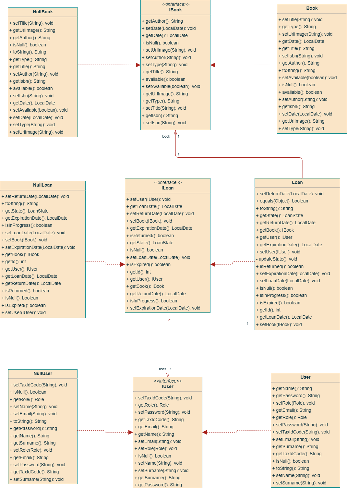

---

### 3. Template Method

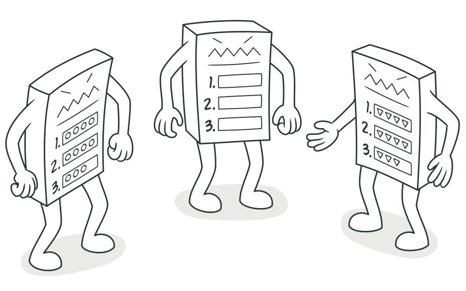

Nel progetto è stato applicato il pattern **Template Method** per definire una struttura generica e riutilizzabile nella gestione della **persistenza dei dati su file JSON**.  
Il punto centrale dell’implementazione è rappresentato dalla classe astratta:

> `JsonTemplateManager<T>`

Questa classe fornisce un **modello standardizzato** per tutte le operazioni comuni di I/O:

- **Serializzazione** e **deserializzazione** tramite Gson
- Lettura da file (`load`)
- Scrittura su file (`save`)
- Versioni asincrone (`loadAsync`, `saveAsync`) tramite `FxTaskRunner`

La classe viene parametrizzata con il tipo `T` e con il tipo array `T[]`, in modo da gestire in modo generico **liste di oggetti di qualsiasi tipo** (libri, utenti, prestiti...).

---

#### Classi concrete

Le classi che estendono `JsonTemplateManager<T>` sono:

- `JsonBookManager` → gestisce `List<Book>`
- `JsonLoanManager` → gestisce `List<Loan>`
- `JsonUserManager` → gestisce `List<User>`

Ognuna specifica solo:
- il **file path**
- il tipo array (`Book[].class`, `Loan[].class`, ...)

Il resto (logica di lettura/scrittura) è ereditato automaticamente.

In questo modo, la logica di persistenza rimane modulare, coerente e facilmente estendibile a nuovi tipi di dati.

---

📌 **Diagramma UML**

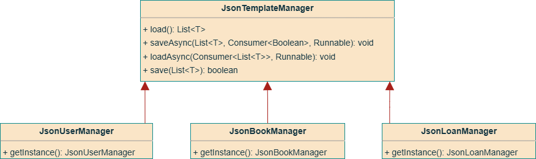

---

### 4. State

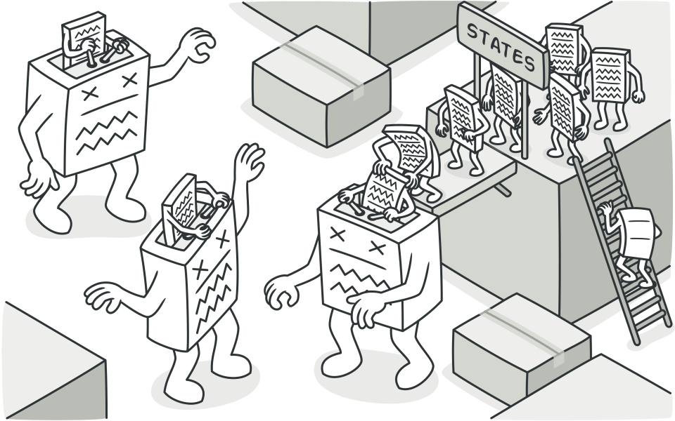

Nel progetto, il pattern **State** è stato adottato per modellare il comportamento variabile di un **prestito** (`Loan`) in base al suo stato attuale: **in corso**, **scaduto**, oppure **restituito**.  
Senza questo pattern, la gestione delle regole sarebbe ricaduta in una serie di controlli `if` o `switch` sparsi nella classe `Loan`, rendendo il codice poco manutenibile.

Il punto centrale dell’implementazione è rappresentato dall’interfaccia:

> `LoanState`

Questa interfaccia fornisce un **modello standardizzato** per rappresentare il comportamento di un prestito nei suoi diversi stati, attraverso i seguenti metodi:
- `isReturned()` – restituisce `true` se il prestito è stato restituito
- `isExpired(LocalDate expirationDate)` – verifica se il prestito è scaduto
- `isInProgress()` – indica se il prestito è attualmente attivo
- `getName()` – restituisce il nome leggibile dello stato

La classe `Loan` delega a `LoanState` la logica relativa allo stato del prestito, rendendo il comportamento interno flessibile e facilmente estendibile.

---

#### Classi concrete

Le classi che implementano `LoanState` sono:

- `InProgressState` → rappresenta un prestito attivo.
    - `isInProgress()` restituisce `true`,
    - gli altri metodi restituiscono `false`.

- `ExpiredState` → rappresenta un prestito scaduto.
    - `isExpired(...)` restituisce `true`.
    - gli altri metodi restituiscono `false`.

- `ReturnedState` → rappresenta un prestito già restituito.
    - `isReturned()` restituisce `true`,
    - gli altri metodi restituiscono `false`.

Ognuno di questi stati implementa in modo diverso i metodi della super-interfaccia, permettendo al contesto (`Loan`) di comportarsi in maniera coerente e priva di `if`.

In questo modo, la logica di gestione degli stati rimane **pulita, chiara** e facilmente **estendibile** a nuovi scenari (es. prenotazione, sospensione, ecc.).

---

📌 **Diagramma UML**

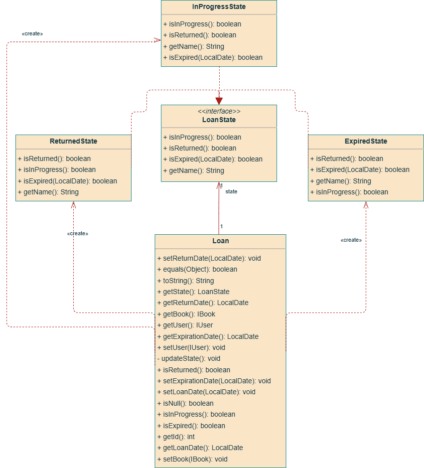

---

### 5. Strategy


Nel progetto è stato applicato il pattern **Strategy** per fornire criteri di ordinamento intercambiabili dei libri, selezionabili dinamicamente in base all'input dell’utente.  
Il punto centrale dell’implementazione è rappresentato dall’interfaccia:

> `BookSortStrategy`

Questa interfaccia non applica direttamente un algoritmo, ma **fornisce un oggetto `Comparator<IBook>`** tramite il metodo:

```java
Comparator<IBook> getComparator();
```

Il comparator viene poi utilizzato nel punto centrale di elaborazione dei risultati (BookQueryUtils) per applicare l’ordinamento.

---

#### Strategie concrete

Le classi che implementano `BookSortStrategy` sono:
- `TitleSortStrategy` → restituisce un Comparator che ordina per titolo alfabetico
- `AuthorSortStrategy` → ordina per autore
- `MostRecentSortStrategy` → ordina per data di pubblicazione in ordine decrescente

Ogni classe implementa `getComparator()` secondo il criterio specifico, lasciando a chi utilizza la strategia la responsabilità di eseguire materialmente l’ordinamento.

---

#### Selezione dinamica della strategia
La strategia viene selezionata a runtime tramite:

> `BookSortStrategyFactory`

che espone il metodo statico:

```java
BookSortStrategy getStrategy(BookOrderType type);
```

dove `BookOrderType` è un `enum` con i valori `TITLE`, `AUTHOR`, `RECENT`.

---

#### Applicazione in `BookQueryUtils`
L'ordinamento non viene eseguito all’interno della strategia, ma in `BookQueryUtils`, che riceve la strategia esternamente e applica il `Comparator` restituito.

Inoltre, **il filtraggio e l’ordinamento avvengono nello stesso punto**, in modo coeso:

```java
List<IBook> getFilteredBooks(List<IBook> books, BookCategoryType category, BookOrderType orderType);
```

La separazione tra filtro e strategia rimane, ma l'applicazione concreta avviene nel medesimo metodo.

---

📌 **Diagramma UML**

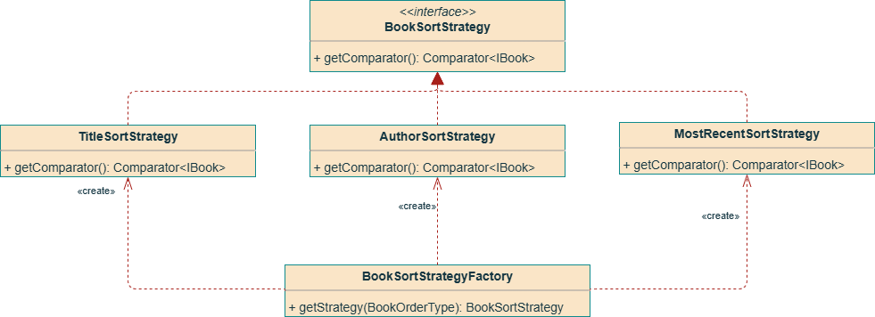

---

### 6. Adapter

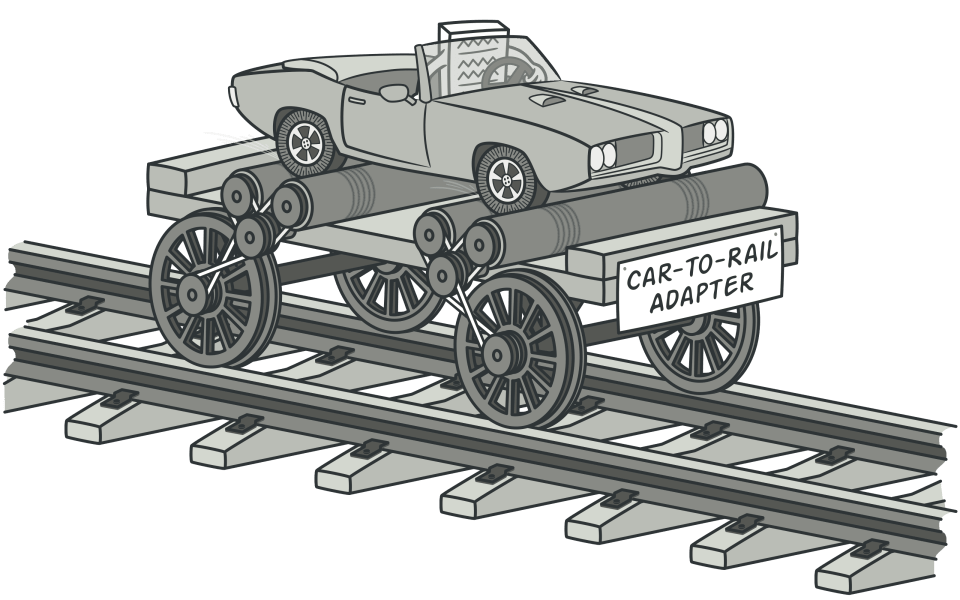

Nel progetto è stato applicato il pattern **Adapter** per garantire la compatibilità tra le **interfacce e classi di dominio** usate nel progetto e il sistema di **serializzazione JSON** basato su `Gson`.  
Il punto centrale dell’implementazione è rappresentato dalle classi:

> `InterfaceAdapter<T>`  
> `LocalDateAdapter`

Entrambi gli adapter **implementano le interfacce `JsonSerializer<T>` e `JsonDeserializer<T>`** offerte da Gson, che permettono di definire manualmente **come serializzare e deserializzare un tipo specifico**.

---

#### Obiettivi degli adapter

- **`InterfaceAdapter<T>`**  
  Gson non può serializzare o deserializzare correttamente oggetti rappresentati da interfacce (come `IBook`, `IUser`, `ILoan`).  
  Questo adapter permette di specificare una **classe concreta** da utilizzare durante la serializzazione e la ricostruzione dell'oggetto.  
  Gestisce inoltre l’inserimento esplicito del tipo (`@type`) se necessario.

- **`LocalDateAdapter`**  
  Il tipo `LocalDate` non è supportato nativamente da Gson.  
  Questo adapter converte il valore in una **stringa ISO** al momento della serializzazione, e viceversa in fase di lettura.

Entrambi vengono registrati nel builder `Gson` nella classe `JsonTemplateManager<T>`:

```java
Gson gson = new GsonBuilder()
    .registerTypeAdapter(LocalDate.class, new LocalDateAdapter())
    .registerTypeAdapter(IBook.class, new InterfaceAdapter<>(Book.class))
    .registerTypeAdapter(IUser.class, new InterfaceAdapter<>(User.class))
    .registerTypeAdapter(ILoan.class, new InterfaceAdapter<>(Loan.class))
    .create();
```

---

---

📌 **Diagramma UML**

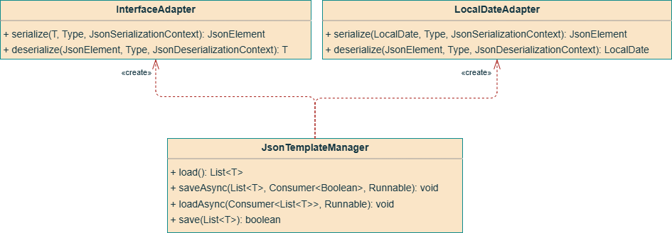

### 7. Observer

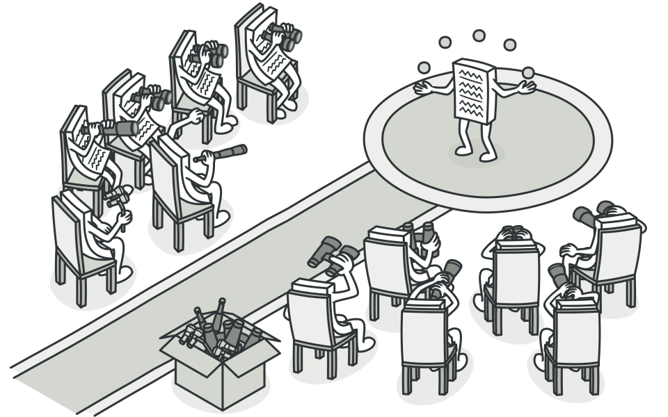

Nel progetto è stato applicato il pattern **Observer** per gestire in modo disaccoppiato la **comunicazione tra componenti della GUI**.  
Il punto centrale dell’implementazione è rappresentato dalle interfacce:

> `ViewSubject`  
> `ViewObserver`

Queste due interfacce definiscono un **meccanismo di registrazione e notifica** tra soggetti e osservatori all'interno dell'interfaccia utente realizzata con JavaFX.

---

#### Obiettivo dell'Observer

All’interno dell’applicazione, alcune componenti della vista devono reagire automaticamente a **cambiamenti di stato**, come ad esempio:
- il login di un utente
- il cambio di schermata
- la modifica di un contenuto nella dashboard

Invece di aggiornare manualmente ogni componente, si è implementato un sistema **reactive-style**: un oggetto soggetto (`ViewSubject`) notifica automaticamente tutti gli osservatori (`ViewObserver`) registrati quando cambia qualcosa.

---

#### Interfacce definite

- **`ViewObserver`**  
  Definisce il metodo:

  ```java
  void updateView();
  ```
  che viene chiamato ogni volta che il soggetto cambia.


- **`ViewSubject`**  
  Permette di registrare, rimuovere e notificare gli osservatori:
  ```java
  void setObserver(ViewObserver observer);
  ```
  Ogni componente che implementa ViewSubject può quindi inviare notifiche.

---

**Perché non Mediator?**

Il pattern **`Mediator`** viene solitamente adottato quando più componenti devono interagire **in modo complesso e bidirezionale**, centralizzando la logica di coordinamento.

Nel nostro caso, però, il **flusso di interazione era semplice e unidirezionale** (es. Sidebar → aggiornamento della AdminView).
Per questo motivo, l’uso di **`Observer`** è risultato più naturale e leggero da integrare.

> **Considerazione futura**:
Se il sistema dovesse evolversi per includere **più viste che interagiscono tra loro o flussi più intricati**, sarà opportuno valutare la sostituzione con un **`Mediator`** per mantenere disaccoppiamento e scalabilità.

---

📌 **Diagramma UML**

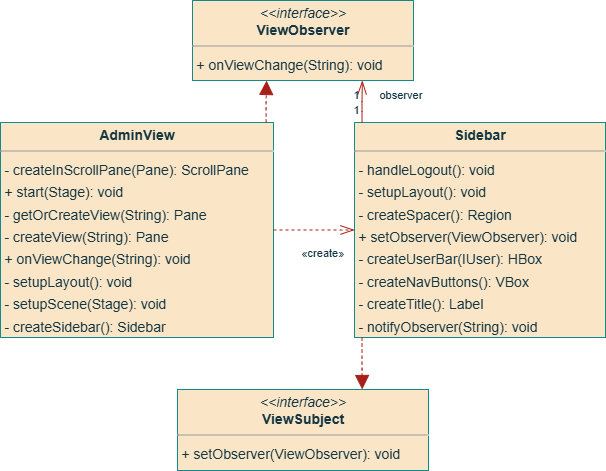

## 🧪 7. Testing

Il sistema è stato testato mediante una combinazione di **test unitari** e **test di integrazione**, con l'obiettivo di verificare il corretto funzionamento dei componenti principali e la stabilità delle interazioni tra moduli.  
Il framework utilizzato per l’esecuzione dei test è:

> `JUnit 5`

---

### Strategie adottate

- **Test unitari**: applicati a singole classi, con particolare attenzione a:
  - correttezza delle operazioni logiche (es. `LoanManager`)
  - gestione dei dati (es. `JsonBookManager`)
  - metodi di utilità e filtri (`BookQueryUtils`)

- **Test di integrazione**: verificano il comportamento combinato di più componenti, ad esempio:
  - `BookController` ↔ `BookManager` + `JsonBookManager`
  - `LoanController` ↔ `LoanManager` + `BookManager`

I test sono stati realizzati **nella fase conclusiva del progetto**, una volta completata l’implementazione delle funzionalità principali.  
Questo ha permesso di validare il comportamento del sistema nel suo complesso e di individuare eventuali regressioni o anomalie logiche prima della consegna finale.

---

### Classi testate

#### **Unit test**
| Package             | Classi testate                         |
|---------------------|----------------------------------------|
| `common.adapter`    | `InterfaceAdapterTest`, `LocalDateAdapterTest` |
| `model`             | `BookTest`, `LoanTest`                 |
| `manager`           | `BookManagerTest`, `LoanManagerTest`   |
| `persistence`       | `JsonTemplateManagerTest`              |
| `common.nullObject` | `NullBookTest`, `NullLoanTest`         |
| `common.state`      | `ExpiredStateTest`                     |
| `common.strategy`   | `AuthorSortStrategyTest`, `BookSortStrategyFactoryTest` |
| `utils`             | `BookQueryUtilsTest`, `FxTaskRunnerTest` |

#### **Integration test**
| Package       | Classi testate                       |
|---------------|--------------------------------------|
| `controller`  | `BookControllerTest`, `LoanControllerTest` |

---

### 🗂️ Struttura della cartella `test/`
```
Digital-Library/
├── test/
   └── java/
       └── com/
           └── example/
               ├── common/
               │   ├── adapter/
               │   ├── nullObject/
               │   ├── observer/
               │   ├── state/
               │   └── strategy/
               ├── controller/
               ├── manager/
               ├── model/
               ├── persistence/
               └── utils/
```

---

## 📈 8. Statistiche e Funzionalità Extra

Oltre ai requisiti funzionali minimi, il sistema implementa alcune **funzionalità aggiuntive** che arricchiscono l’esperienza d’uso e offrono strumenti utili per l’analisi e l’interazione con il catalogo.

---

### Statistiche

Il sistema fornisce una sezione dedicata alla visualizzazione di **statistiche dinamiche**, accessibile tramite l’interfaccia admin.  
Le statistiche vengono calcolate runtime a partire dai dati presenti nei file JSON e includono:

- **Libri totali**  
  Conteggio globale dei libri registrati nel sistema.

- **Utenti totali**  
  Conteggio globale degli utenti registrati nel sistema.

- **Prestiti totali**  
  Conteggio globale dei prestiti registrati nel sistema.

- **Libri e Utenti recenti**  
  Selezione dei libri e utenti più recenti per evidenziare l'attività attuale della biblioteca.

---

### Funzionalità Extra

Oltre alle funzionalità previste nei requisiti, sono state implementate le seguenti estensioni:

- **Interfaccia grafica con JavaFX**  
  L’interfaccia testuale (CLI) è stata completamente sostituita da una GUI responsive, con viste distinte per utenti normali e amministratori.

- **Filtri avanzati e ordinamento dinamico**  
  I libri possono essere filtrati per categoria, autore e disponibilità, e ordinati per titolo, autore o data in modo runtime grazie al pattern Strategy.

- **Separazione completa View ↔ Controller ↔ Model**  
  Implementazione pulita dell’architettura MVC, che facilita manutenzione e test.

- **Persistenza asincrona**  
  Tutte le operazioni di lettura e scrittura su file avvengono in background tramite `FxTaskRunner`, migliorando la reattività della GUI.

- **Copertura test unitari ed integration test**  
  Ampia copertura delle funzionalità chiave tramite `JUnit`, anche se introdotti nella fase finale, hanno migliorato l'affidabilità del sistema.

- **Estensibilità modulare**  
  L'intero sistema è pensato per essere facilmente estendibile con nuovi tipi di entità o nuove strategie di filtraggio, grazie alla modularità introdotta dai pattern GoF.

---

Queste funzionalità aggiuntive hanno reso il progetto più solido, usabile e vicino a una reale applicazione desktop per la gestione di una biblioteca.

---

## 📎 9. Conclusione

Lo sviluppo del progetto **Biblioteca Digitale** ci ha permesso di mettere in pratica molte delle competenze acquisite durante il corso, sia sul piano tecnico che organizzativo.  
Il lavoro di squadra, la divisione modulare del codice e l’adozione consapevole dei design pattern hanno contribuito a realizzare un sistema funzionale, pulito e facilmente estendibile.

---

### Bilancio del lavoro svolto

Siamo riusciti a implementare tutte le funzionalità richieste, integrando anche numerose estensioni: GUI completa, statistiche, ordinamento dinamico, persistenza asincrona, e una copertura di test soddisfacente.  
Il codice è stato strutturato seguendo l’architettura MVC e arricchito con sette design pattern GoF, applicati in contesti concreti e motivati.

---

### Difficoltà incontrate

- **Gestione dello stato dei prestiti**: inizialmente implementato in modo procedurale, è stato poi rifattorizzato applicando il pattern State.
- **Compatibilità con Gson**: la serializzazione di interfacce e di `LocalDate` ha richiesto l’introduzione di adapter dedicati.
- **Separazione View ↔ Controller**: nelle prime fasi c’erano accoppiamenti eccessivi tra la GUI e la logica; risolto con un refactoring strutturato.
- **Testing tardivo**: i test sono stati introdotti solo nella fase finale, rendendo più difficile intercettare bug nelle prime versioni.

---

### Cosa avremmo migliorato con più tempo

- Introduzione precoce dei test automatici, per abilitare un workflow TDD o almeno test-after modulare.
- Miglior gestione dello styling della GUI (CSS), per rendere l'interfaccia più curata anche visivamente.
- Un sistema di logging strutturato, per facilitare debugging e monitoraggio interno.
- Supporto multiutente con sessioni persistenti o autenticazione avanzata.

---

Nel complesso, il progetto si è rivelato un’occasione efficace per consolidare conoscenze teoriche e affrontare sfide concrete di progettazione software.

---

## 📘 Riferimenti

### Libri e Materiale Accademico

* *Gamma, Helm, Johnson, Vlissides*. **Design Patterns: Elements of Reusable Object-Oriented Software**. Addison-Wesley, 1994.
  Testo fondativo sui design pattern, da cui provengono i 7 pattern applicati nel progetto.

* Appunti e slide del corso di **Ingegneria del Software** – Università di Catania.

---

### Risorse Tecniche

* **Gson – Google JSON library for Java**
  [https://github.com/google/gson](https://github.com/google/gson)

* **JavaFX Documentation**
  [https://openjfx.io/](https://openjfx.io/)

* **JUnit 5 Documentation**
  [https://junit.org/junit5/](https://junit.org/junit5/)

---

### Approfondimenti Utili

* **Refactoring.Guru – Pattern object-oriented illustrati**
  [https://refactoring.guru/design-patterns](https://refactoring.guru/design-patterns)
